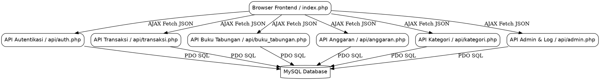
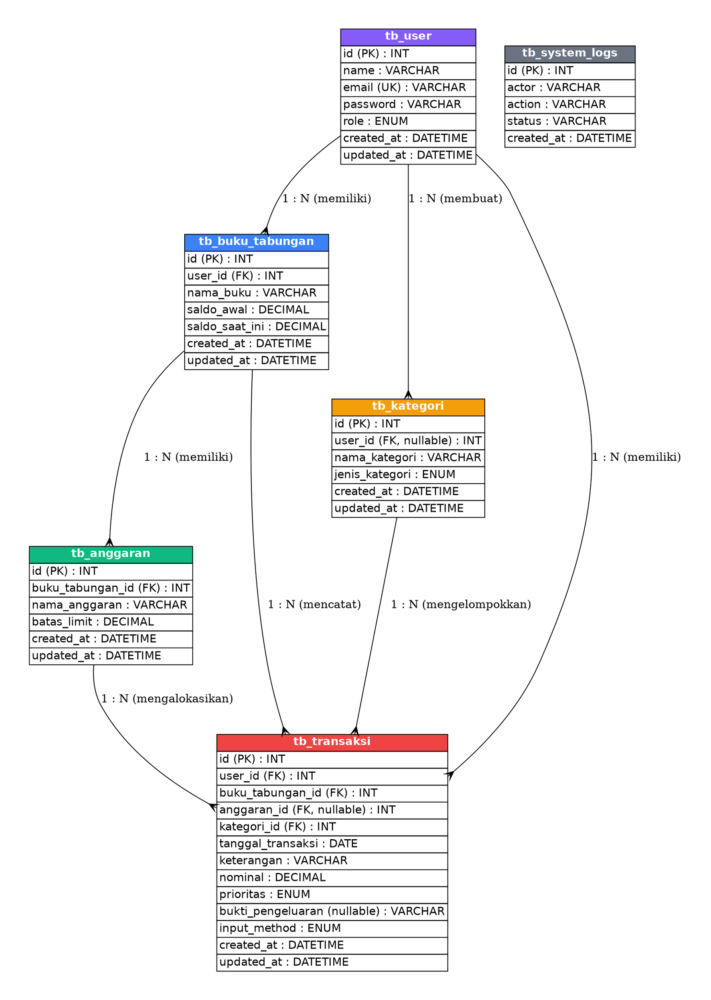

# Arsitektur & Desain Sistem - SisaJejakUang

Dokumen ini menjelaskan arsitektur perangkat lunak, struktur direktori, dan perancangan basis data relasional untuk aplikasi **SisaJejakUang**.

---

## 1. Arsitektur Perangkat Lunak

Aplikasi **SisaJejakUang** menggunakan arsitektur **Single Page Application (SPA)** sederhana berbasis **Native PHP** di sisi backend dan kombinasi **Tailwind CSS + Vanilla JS** di sisi frontend.

* **Frontend**: Antarmuka web disajikan melalui satu file utama, yaitu `index.php`. Navigasi antar halaman disimulasikan menggunakan JavaScript dengan memanipulasi visibilitas (show/hide) elemen HTML menggunakan class Tailwind CSS (`hidden`). Kueri dan pembaruan data dilakukan secara asinkron menggunakan `fetch()` API ke backend PHP.
* **Backend**: Kumpulan skrip PHP modular di dalam folder `api/` bertindak sebagai API Endpoints. backend ini bertugas memproses data input dari frontend, memvalidasi aturan bisnis (misalnya pembatasan limit anggaran), mengelola sesi aktif (`session_start`), dan berkomunikasi dengan MySQL RDBMS melalui driver **PDO (PHP Data Objects)**.
* **Database**: Database relasional **MySQL** menyimpan seluruh data persisten (User, Tabungan, Anggaran, Kategori, Transaksi, dan Audit Log).



---

## 2. Struktur Direktori Proyek

Berikut adalah struktur direktori aplikasi **SisaJejakUang**:

```text
sisajejakuang_2/
│
├── config/
│   └── db.php                  # Konfigurasi & inisialisasi koneksi PDO ke MySQL
│
├── database/
│   └── db_sisajejakuang.sql    # Skema DDL dan data awal (seeds) untuk database
│
├── dokumentasi/
│   ├── arsitektur_dan_desain.md # Dokumen arsitektur dan database (Dokumen Ini)
│   ├── panduan_instalasi.md     # Langkah-langkah menjalankan aplikasi di lokal
│   ├── dokumentasi_api.md       # Spesifikasi request/response API endpoint
│   ├── panduan_pengguna.md      # Manual operasional user dan admin
│   └── riwayat_pengembangan.md # Log perubahan dan catatan rilis pengembangan
│
├── api/                        # API Endpoints untuk melayani request AJAX JSON
│   ├── auth.php                # Autentikasi (login, register, logout, hapus akun)
│   ├── dashboard.php           # Data agregat dashboard user dan admin
│   ├── transaksi.php           # CRUD Transaksi dan upload bukti transaksi
│   ├── buku_tabungan.php       # CRUD Buku Tabungan
│   ├── anggaran.php            # CRUD Anggaran dengan validasi limit saldo
│   ├── kategori.php            # CRUD Kategori master dan kustom
│   └── admin.php               # Halaman log audit & manajemen sistem admin
│
├── uploads/
│   └── receipts/               # Folder untuk menyimpan bukti upload struk transaksi
│
├── index.php                   # Halaman utama aplikasi (Frontend SPA & Router)
└── implementation_plan.md      # Rencana kerja pengembangan awal
```

---

## 3. Desain Basis Data (MySQL)

### Diagram Hubungan Entitas (ERD)

Aplikasi ini menggunakan skema relasional dengan dependensi *Foreign Key* dan aksi *Cascading* (`ON DELETE CASCADE`) untuk memastikan integritas data.



### Kamus Data Tabel Utama

1. **`tb_user`**: Menyimpan data identitas kredensial pengguna dan perannya.
   * `id`: Primary key pengguna.
   * `role`: Menentukan hak akses pengguna (`admin` untuk panel global, `user` untuk personal).
2. **`tb_buku_tabungan`**: Wadah rekening/dompet keuangan mandiri milik user.
   * `saldo_saat_ini`: Saldo aktif yang disesuaikan secara dinamis berdasarkan kalkulasi transaksi kredit/debet.
3. **`tb_anggaran`**: Pos pengeluaran terencana yang diikat pada buku tabungan.
   * `batas_limit`: Nilai limit anggaran. Aturan bisnis menetapkan nilai ini tidak boleh melebihi `saldo_saat_ini` pada buku tabungan terkait.
4. **`tb_kategori`**: Klasifikasi transaksi. Kategori berskala master memiliki `user_id` bernilai `NULL` (dapat digunakan oleh semua user).
5. **`tb_transaksi`**: Catatan jurnal transaksi keuangan debet atau kredit.
   * `prioritas`: Sifat prioritas anggaran (`Kebutuhan` atau `Keinginan`).
   * `bukti_pengeluaran`: Path penyimpanan file struk belanja.
6. **`tb_system_logs`**: Log audit jejak sistem untuk merekam aksi login, manipulasi data keuangan, dan perubahan penting lainnya.
