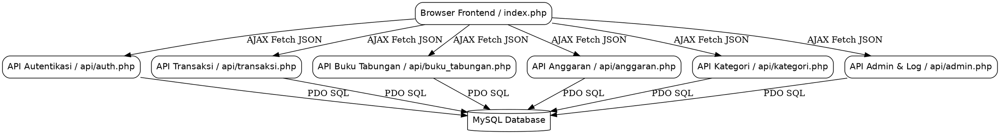
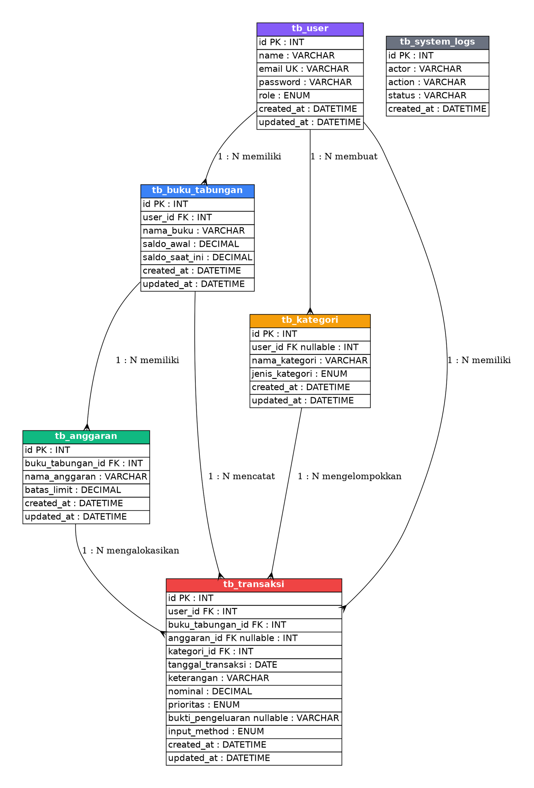

# BAB 3: PERANCANGAN SISTEM

## 3.1 Arsitektur Sistem
Sistem aplikasi **SisaJejakUang** menggunakan model arsitektur terpisah sederhana yang memisahkan antara layer presentasi yaitu Frontend dan layer pemrosesan data yaitu Backend dan Database. Hal ini bertujuan agar kode program lebih modular, rapi, dan mudah dirawat.

* **Frontend Layer**: Berupa file tunggal `index.php` yang menggabungkan elemen struktur HTML5, styling Tailwind CSS, dan pustaka ikon Lucide. Klien menangani interaksi pengguna dan memperbarui konten halaman secara dinamis menggunakan Vanilla JavaScript tanpa memuat ulang browser.
* **API Backend Layer**: Terdiri dari skrip-skrip PHP modular di dalam folder `api/`. Skrip ini menerima request AJAX berupa metode GET, POST, dan DELETE dari JavaScript, melakukan validasi aturan bisnis, memproses query SQL, dan mengembalikan respons terstruktur dalam format JSON.
* **Database Layer**: RDBMS MySQL yang diakses menggunakan driver PHP Data Objects yaitu PHP Data Objects untuk memastikan komunikasi basis data yang aman dari celah keamanan seperti SQL Injection.

Berikut adalah diagram aliran data arsitektur sistem secara vertikal menggunakan Graphviz:

---

## 3.2 Workflow Sistem
Alur kerja utama dalam ekosistem sistem digambarkan melalui narasi operasional di bawah ini:
1. **Inisialisasi Sesi**: Pengguna memasukkan email dan password -> Browser mengirim request autentikasi ke `api/auth.php` -> Sistem memeriksa data dan password hash -> Jika cocok, sistem mencatat detail ke dalam session PHP server dan mengembalikan respons sukses -> Browser memuat halaman dashboard utama secara dinamis.
2. **Pembuatan Dompet**: Pengguna menginputkan nama dompet tabungan dan nominal saldo awal -> Data dikirim ke `api/buku_tabungan.php` -> Saldo disimpan di MySQL -> Halaman dashboard memuat ulang visualisasi tabungan secara asinkron.
3. **Pengaturan Anggaran Terkendali**: Pengguna memilih buku tabungan dan memasukkan rencana batas anggaran belanja -> Request dikirim ke `api/anggaran.php` -> Backend melakukan pengecekan saldo aktif dompet tabungan terkait -> Jika limit melebihi saldo tabungan, sistem membatalkan kueri dan mengirim pesan error -> Jika sukses, anggaran dicatat.
4. **Pencatatan Belanja Harian**: Pengguna mencatat transaksi pengeluaran dan mengunggah gambar struk -> Request dikirim ke `api/transaksi.php` -> Backend menyimpan gambar struk ke folder `/uploads/receipts/`, memotong nilai saldo saat ini pada buku tabungan terkait, mencatat transaksi belanja, dan menuliskan audit log ke `tb_system_logs` -> Tampilan grafikanalisis di dashboard otomatis diperbarui.

---

## 3.3 Class Diagram
Struktur pemrograman logika berorientasi objek sederhana yang direpresentasikan dalam modul backend aplikasi ini digambarkan melalui daftar kelas konseptual berikut:
* **Class User**:
  * Atribut: `id` bertipe integer, `name` bertipe string, `email` bertipe string, `password` bertipe string, `role` bertipe enum.
  * Metode: `login` dengan parameter email dan password, `register` dengan parameter name, email, password, dan role, `logout`, `deleteAccount`.
* **Class BukuTabungan**:
  * Atribut: `id` bertipe integer, `userId` bertipe integer, `namaBuku` bertipe string, `saldoAwal` bertipe decimal, `saldoSaatIni` bertipe decimal.
  * Metode: `create` dengan parameter namaBuku dan saldoAwal, `readByUserId` dengan parameter userId, `updateSaldo` dengan parameter amount.
* **Class Anggaran**:
  * Atribut: `id` bertipe integer, `bukuTabunganId` bertipe integer, `namaAnggaran` bertipe string, `batasLimit` bertipe decimal.
  * Metode: `create` dengan parameter bukuTabunganId, namaAnggaran, dan batasLimit, `delete` dengan parameter id, `validateAgainstBalance` dengan parameter limit.
* **Class Transaksi**:
  * Atribut: `id` bertipe integer, `userId` bertipe integer, `bukuTabunganId` bertipe integer, `anggaranId` bertipe integer, `kategoriId` bertipe integer, `tanggal` bertipe date, `keterangan` bertipe string, `nominal` bertipe decimal, `prioritas` bertipe enum, `bukti` bertipe string, `method` bertipe enum.
  * Metode: `create`, `delete` dengan parameter id, `readAllByUserId` dengan parameter userId.
* **Class Kategori**:
  * Atribut: `id` bertipe integer, `userId` bertipe integer, `namaKategori` bertipe string, `jenis` bertipe enum.
  * Metode: `create` dengan parameter namaKategori dan jenis, `delete` dengan parameter id, `read`.

---

## 3.4 Entity Relationship Diagram atau ERD
Struktur fisik relasi tabel pada basis data `db_sisajejakuang` digambarkan secara vertikal dengan detail spesifikasi Graphviz di bawah ini:

