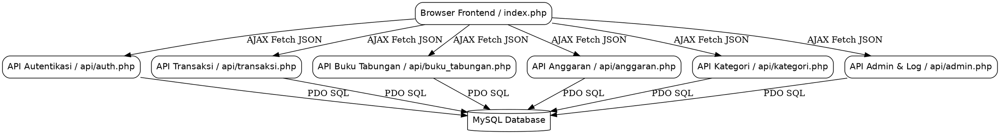
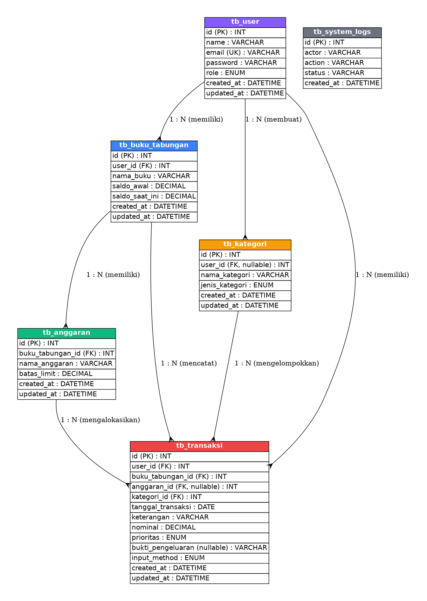

# Laporan Akhir Pengembangan Proyek 1: SisaJejakUang

Dokumen ini merupakan laporan akhir lengkap mengenai analisis, perancangan, implementasi, dan pengujian sistem aplikasi **SisaJejakUang** berdasarkan berkas panduan outline proyek.

---

## BAB 1: PENDAHULUAN

### 1.1 Latar Belakang
Dalam kehidupan sehari-hari, khususnya bagi mahasiswa dan pekerja muda, manajemen keuangan pribadi sering kali menjadi tantangan yang sulit diatasi. Banyak individu mengalami fenomena di mana uang saku atau gaji bulanan habis sebelum waktunya tanpa disadari ke mana dana tersebut dialokasikan. Pelacakan manual menggunakan buku catatan fisik atau spreadsheet sering kali ditinggalkan karena tidak praktis dan tidak memberikan visualisasi metrik yang instan. 

Kondisi manajemen keuangan saat ini masih didominasi oleh pencatatan manual yang rentan terhadap kehilangan data atau kurangnya kedisiplinan pengisian. Oleh karena itu, penting untuk membangun sebuah sistem terkomputasi berbasis web yang dapat merekam transaksi secara instan, mengelompokkannya secara otomatis, membatasi pos anggaran sesuai kemampuan tabungan, dan memberikan analisis kesehatan keuangan (*Financial Health Score*) secara langsung.

### 1.2 Nama Aplikasi dan Dasar Ide
Aplikasi ini dinamakan **SisaJejakUang** (Sistem Manajemen Keuangan Kelompok 31). Arti dari nama ini mencerminkan tujuan sistem, yaitu merekam jejak aliran keluar-masuk setiap rupiah agar pengguna dapat mengetahui secara presisi "sisa" uang saku mereka dan bagaimana jejak pengeluaran mereka terbentuk.

Dasar ide pengembangan aplikasi ini berawal dari permasalahan finansial anak kost (mahasiswa) yang sering mengalami krisis keuangan di akhir bulan. Melalui pencatatan berbasis multi-rekening (dompet fisik, rekening bank, e-wallet) dan pos anggaran terbatas, aplikasi ini dirancang untuk melacak sisa uang secara cerdas.

### 1.3 Tujuan Pengembangan
#### 1.3.1 Tujuan Umum:
* Meningkatkan literasi keuangan digital pengguna serta mendidik kedisiplinan dalam berbelanja.
* Memberikan dampak positif bagi stabilitas keuangan pribadi masyarakat luas melalui kontrol anggaran yang ketat.

#### 1.3.2 Tujuan Khusus:
* Menyediakan fitur pencatatan multi-dompet (*Buku Tabungan*) yang dinamis.
* Menerapkan aturan bisnis (*business logic constraint*) yang mencegah pembuatan anggaran melebihi saldo tabungan.
* Menganalisis sifat pengeluaran pengguna berdasarkan skala prioritas Kebutuhan (*Needs*) dan Keinginan (*Wants*).
* Menyediakan simulasi entri cepat menggunakan teknologi pembacaan struk belanja digital (*OCR*).

### 1.4 Ruang Lingkup
Pengembangan aplikasi **SisaJejakUang** dibatasi pada ruang lingkup berikut:
* **Platform**: Aplikasi web responsif menggunakan Native PHP murni di sisi backend dan Tailwind CSS + Vanilla JS di sisi frontend (SPA).
* **Lingkungan**: Berjalan di lingkungan server lokal menggunakan **XAMPP** (Apache & MySQL).
* **Pengguna**: Sistem mendukung dua tingkat peran pengguna (*multi-user* dengan otorisasi berbasis sesi): *User* biasa untuk pencatatan keuangan pribadi, dan *Admin* untuk pemantauan audit log ekosistem secara global.
* **Fitur Utama**: Manajemen buku tabungan, anggaran spesifik dengan validasi saldo, pencatatan transaksi manual/OCR, pengelolaan kategori kustom, dashboard statistik, log sistem global, dan penghapusan akun permanen mandiri.

---

## BAB 2: DESKRIPSI SISTEM

### 2.1 Gambaran Umum Aplikasi
**SisaJejakUang** bekerja sebagai aplikasi satu halaman (*Single Page Application* / SPA) yang interaktif. Pengguna memulainya dengan masuk ke sistem melalui halaman autentikasi. Setelah berhasil masuk, pengguna disajikan ringkasan visual kesehatan keuangan mereka di dashboard. 

Pengguna dapat membuat beberapa dompet tabungan (misalnya: "Gopay", "Bank Mandiri") dan membagi uangnya ke dalam pos anggaran tertentu (misalnya: "Uang Makan", "Jajan"). Setiap kali pengguna mencatat pengeluaran di tab transaksi, sistem akan mengurangi saldo buku tabungan yang dipilih secara otomatis serta memperbarui grafik konsumsi anggaran.

### 2.2 Stakeholder dan User
Sistem ini membagi aktor pengguna menjadi 2 peran utama:
1. **Pengguna Biasa (User)**:
   * Hak Akses: Membuat dan mengelola dompet tabungan pribadi, membuat pos anggaran spesifik, mencatat transaksi pemasukan/pengeluaran, mengunggah bukti struk, dan menghapus akun mereka sendiri.
2. **Administrator (Admin)**:
   * Hak Akses: Memantau rasio kepatuhan anggaran seluruh pengguna, melihat tingkat adopsi fitur scan OCR, mengelola kategori master global, melihat ringkasan audit data pengguna, memantau *System Audit Logs*, mengekspor skema SQL database fisik, dan menghapus akun administrator aktif.

### 2.3 Kebutuhan Fungsional
| ID Kebutuhan | Deskripsi Fitur Fungsional |
| :--- | :--- |
| **FR-01** | Autentikasi Pengguna (Login, Register, Logout, Hapus Akun). |
| **FR-02** | Pembuatan dan Pembaruan Saldo Buku Tabungan. |
| **FR-03** | Pengaturan Anggaran Spesifik (dengan batas maksimum saldo tabungan). |
| **FR-04** | Pencatatan Transaksi Keuangan (Manual & Simulasi OCR). |
| **FR-05** | Manajemen Kategori (Kategori Master Global & Kategori Kustom User). |
| **FR-06** | Dashboard Analitik (Financial Health Score, Rasio Kepatuhan Anggaran, Rasio Needs vs Wants). |
| **FR-07** | Ekspor Database Fisik (.sql) untuk Administrator. |
| **FR-08** | Pencatatan Log Audit Aktivitas Sistem (*tb_system_logs*). |

### 2.4 Kebutuhan Non-Fungsional
* **Usability**: Tampilan antarmuka menggunakan gaya desain premium dengan skema warna yang ramah pengguna, ikon dari Lucide, serta navigasi satu halaman tanpa memuat ulang layar browser.
* **Performance**: Waktu respons API backend untuk pemrosesan JSON harus di bawah 100ms pada lingkungan server localhost.
* **Security**: Keamanan sesi menggunakan session bawaan PHP, penyimpanan password menggunakan hash standar industri (`password_hash` dengan algoritma `PASSWORD_DEFAULT`), serta integritas database menggunakan relasi kunci asing (*Foreign Key Constraints*) dengan opsi `ON DELETE CASCADE`.

---

## BAB 3: PERANCANGAN SISTEM

### 3.1 Arsitektur Sistem
Aplikasi web ini mengadopsi model arsitektur terpisah sederhana:
* **Frontend Layer**: Berupa file `index.php` yang memproses visualisasi UI menggunakan framework CSS Tailwind dan memanipulasi DOM menggunakan JavaScript.
* **API Middleware Layer**: Kumpulan API endpoint di folder `api/` yang memproses parameter request JSON dan mengembalikan data dalam format JSON menggunakan PHP.
* **Database Layer**: RDBMS MySQL yang diakses melalui PHP PDO Driver untuk menjamin keamanan dari serangan SQL Injection.

Berikut adalah diagram arsitektur data secara vertikal menggunakan Graphviz:

### 3.2 Workflow Sistem
Alur kerja sistem secara ringkas berjalan sebagai berikut:
1. **Sesi Masuk**: Pengguna melakukan Login -> Sistem memverifikasi hash password di database -> Jika cocok, sesi disimpan di server dan mengembalikan detail pengguna -> Halaman utama beralih ke dashboard.
2. **Pengisian Dompet**: Pengguna membuat Buku Tabungan -> Nominal saldo awal tercatat di database.
3. **Penyusunan Rencana Belanja**: Pengguna membuat Anggaran pada Buku Tabungan -> Sistem memeriksa apakah nominal limit anggaran melebihi saldo tabungan -> Jika valid, data disimpan ke database.
4. **Pencatatan Belanja**: Pengguna mencatat transaksi pengeluaran dan memilih pos anggaran -> Sistem mengurangi saldo tabungan terkait -> Sistem mencatat log aktivitas -> Grafik dashboard diperbarui secara asinkron.

### 3.3 Class Diagram
Representasi class logic sederhana pada aplikasi ini digambarkan melalui struktur objek berikut:
* **User**: Atribut (`id`, `name`, `email`, `password`, `role`). Metode (`login()`, `register()`, `logout()`, `deleteAccount()`).
* **BukuTabungan**: Atribut (`id`, `userId`, `namaBuku`, `saldoAwal`, `saldoSaatIni`). Metode (`create()`, `read()`, `updateSaldo()`).
* **Anggaran**: Atribut (`id`, `bukuTabunganId`, `namaAnggaran`, `batasLimit`). Metode (`create()`, `delete()`, `validateLimit()`).
* **Transaksi**: Atribut (`id`, `userId`, `bukuTabunganId`, `anggaranId`, `kategoriId`, `tanggal`, `keterangan`, `nominal`, `prioritas`, `bukti`, `method`). Metode (`create()`, `delete()`, `readAll()`).
* **Kategori**: Atribut (`id`, `userId`, `namaKategori`, `jenis`). Metode (`create()`, `delete()`, `read()`).

### 3.4 Entity Relationship Diagram (ERD)
Hubungan fisik antar tabel pada database `db_sisajejakuang` digambarkan secara vertikal dengan spesifikasi Graphviz di bawah ini:

---

## BAB 4: DESAIN ANTARMUKA

### 4.1 Konsep Desain
Konsep desain antarmuka mengacu pada kegunaan tinggi (*high usability*) dan kenyamanan mata pengguna. Menggunakan konsep **Glassmorphism** dengan paduan warna latar belakang abu-abu terang (*slate-50*), kartu kaca semi-transparan, font modern Google Fonts **Plus Jakarta Sans**, serta warna fungsional yang kuat (Indigo untuk aksen utama, Emerald untuk indikator positif/saldo, Rose untuk peringatan/pengeluaran).

### 4.2 Mockup / Wireframe
Struktur tata letak dashboard dirancang sebagai berikut:
* **Top Header**: Logo aplikasi, nama & email pengguna aktif, dan tombol pintas Logout.
* **Layout Utama (2 Kolom)**:
  * **Sidebar (Hanya Mode Admin)**: Navigasi cepat menuju dashboard global, master kategori, audit pengguna, audit database, dan panduan.
  * **Area Konten Utama**: Menampilkan tab panel interaktif. Bagian atas memuat kartu skor kesehatan keuangan dan indikator nominal, diikuti oleh tabel transaksi dan riwayat aktivitas.

### 4.3 Deskripsi Tampilan
1. **Halaman Autentikasi**: Memuat kartu masuk (login) dan daftar (register) yang dapat berpindah secara mulus menggunakan animasi tab.
2. **Dashboard User**: Memuat Financial Health Score, perbandingan prioritas Needs vs Wants, ringkasan saldo, dan riwayat aktivitas transaksi.
3. **Tabungan & Anggaran**: Berisi daftar kartu tabungan. Setiap kartu memiliki tombol dropdown untuk membuka daftar target anggaran di bawahnya serta tombol hapus anggaran.
4. **Transaksi & Kategori**: Memuat formulir pembuatan kategori kustom, jurnal pencatatan transaksi umum, dan detail penjelasan transaksi jurnal umum secara modular.
5. **Dashboard Admin**: Berisi panel statistik ekosistem global, audit log sistem, audit data nominal pengguna, dan tombol cadangan database SQL.

---

## BAB 5: IMPLEMENTASI DASAR

### 5.1 Tools dan Teknologi
* **Bahasa Pemrograman**: PHP (PHP 8.x) & JavaScript (ES6+).
* **Styling (CSS)**: Tailwind CSS (diakses via CDN).
* **Database RDBMS**: MySQL (dikelola lewat phpMyAdmin).
* **Web Server**: Apache pada paket utilitas **XAMPP**.
* **Driver Database**: PHP Data Objects (PDO) dengan mode deteksi error exception aktif.

### 5.2 Struktur Folder
Berikut adalah susunan berkas utama proyek pada direktori web server:
* `/config/db.php`: Skrip inisialisasi koneksi MySQL PDO.
* `/database/db_sisajejakuang.sql`: Berkas ekspor struktur DDL database dan seeds data.
* `/api/`: Berisi API Endpoint backend (auth, transaksi, kategori, anggaran, buku tabungan, dashboard, admin).
* `/uploads/receipts/`: Folder penyimpanan berkas foto bukti struk belanja fisik.
* `/dokumentasi/`: Folder penyimpanan berkas panduan dan laporan proyek (Format Markdown).
* `/index.php`: Pintu masuk tunggal aplikasi (Frontend SPA).

### 5.3 Petunjuk Menjalankan Aplikasi
1. Ekstrak folder proyek `sisajejakuang_2` ke folder `htdocs` instalasi XAMPP Anda (`C:\xampp\htdocs\`).
2. Jalankan **XAMPP Control Panel**, lalu aktifkan modul **Apache** dan **MySQL**.
3. Akses `http://localhost/phpmyadmin/` di browser, lalu buat database baru bernama `db_sisajejakuang`.
4. Pilih database tersebut, masuk ke tab **Import**, pilih file `/database/db_sisajejakuang.sql` pada folder proyek, kemudian klik **Import**.
5. Buka berkas `/config/db.php` di editor teks dan sesuaikan konfigurasi port/password MySQL lokal Anda jika diperlukan.
6. Akses aplikasi melalui browser Anda pada alamat: `http://localhost/sisajejakuang_2/`.

---

## BAB 6: PENUTUP

### 6.1 Kesimpulan
Pengembangan aplikasi **SisaJejakUang** berhasil menyelesaikan masalah pelacakan keuangan secara dinamis dan aman. Fitur-fitur utama seperti pembuatan multi-tabungan, pemisahan kebutuhan & keinginan, serta sistem logging sistem berjalan secara otomatis. Penambahan validasi aturan batas anggaran (tidak boleh melebihi saldo tabungan) dan fitur hapus akun mandiri terbukti meningkatkan keandalan sistem dan memberikan kontrol privasi yang lebih baik kepada pengguna sesuai dengan standar operasional yang direncanakan.

### 6.2 Saran Pengembangan
Beberapa poin saran konkret untuk pengembangan aplikasi di masa mendatang antara lain:
1. **Integrasi OCR Real-Time**: Menghubungkan modul OCR dengan layanan cloud (seperti Google Cloud Vision API) untuk melakukan ekstraksi nilai nominal dan item belanja secara otomatis dari foto struk asli.
2. **Notifikasi Bot**: Menambahkan modul bot Telegram atau WhatsApp API untuk mengirimkan peringatan jika saldo tabungan menipis atau pengeluaran melebihi limit anggaran harian.
3. **Ekspor PDF/Excel**: Menyediakan fitur ekspor laporan berkala transaksi bulanan langsung ke dalam format file PDF atau Excel (.xlsx) untuk mempermudah pelaporan eksternal.
